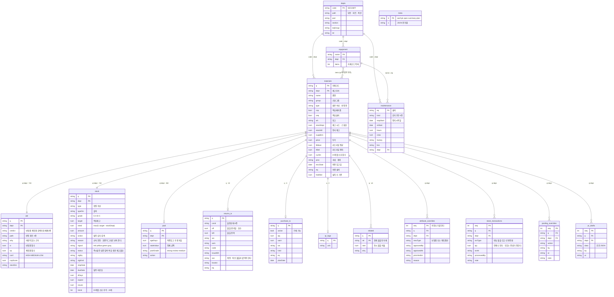

# DB ERD

`db/posco_mtrl.sqlite` 와 `assets/db-*.js` 가 같은 구조다.
**PK 는 `q` + `dept` 두 칸이고, 743개 조합이 전체 모집단이다.**



---

## 3층 구조

| 층 | 표 | 쓰기 | 수명 |
| --- | --- | --- | --- |
| **1층 정본** | `depts` `materials` `equipment` `maintenance` | 생성기만 | 대회 내내 고정 |
| **2층 파생** | `attr` `stock` `pool` | 생성기만 | 대회 내내 고정 |
| **업무 상태** | `returns_tx` `purchase_tx` `qr_tags` `related` | 생성기만 | 고정 |
| **3층 오버라이드** | `attribute_overrides` `stock_transactions` `pooling_overrides` `pr_drafts` | 화면 | 브라우저에 누적 |
| 부속 | `meta` (기준일 · 명세상수 · 요약값 · 정비계획) | 생성기만 | 고정 |

**원본을 절대 덮지 않는다.** 승인도 반납도 3층에 이력으로만 쌓고,
읽는 쪽이 매번 `1층 + 2층 + 3층` 을 겹쳐 본다.

```
속성 결정   오버라이드 > 알고리즘 확정(보험품·계획품) > 정본 Type
현재고      stockDept(스냅샷) + Σ stock_transactions
부호        반납 +1 · 입고 +1 · 불출 -1 · 공용전환 -1
```

`materials.stockDept` 는 **재고 시드**다. 현재고 컬럼이 아니다.
수량 필드를 고쳐 쓰면 두 번 반납했을 때 무엇이 맞는지 알 수 없게 된다.

---

## 읽을 때 조심할 것 세 개

1. **`maintenance` 의 선언 PK 가 유일하지 않다.**
   `(eq, kind, stopStart)` 가 12건 중복이다 (전부 2026-11-27 합리화).
   `GROUP BY` 없이 조인하면 행이 두 배로 불어나고 **오류는 안 난다.**
   SQLite 에서는 이 표만 대리키 `rid` 로 받았다.

2. **`equipment.items` 는 세미콜론 목록이다.** 정규화되어 있지 않다.
   설비 · 자재는 실제로 다대다다 (자재 하나가 여러 설비에 걸린다).

3. **업무 표(`returns_tx` `purchase_tx` `qr_tags` `related`)에는 자재의 정체가 없다.**
   품명 · 단가 · 리드타임 · 등급을 여기 두면 정본과 갈린다.
   코드로 `materials` 를 조인해서 쓴다.

---

## 건수

```
depts 1 · materials 743 · equipment 14 · maintenance 156
attr 743 · stock 743 · pool 262
returns_tx 10 · purchase_tx 6 · qr_tags 2 · related 3
```
